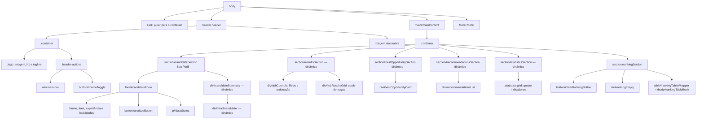

# SkillMatch JS

Aplicação web em JavaScript puro que compara o perfil de uma pessoa candidata com vagas fictícias de Front-End. Ela calcula a compatibilidade, aponta habilidades faltantes, recomenda estudos e mantém um ranking local no navegador.

## Links do projeto

- [Repositório no GitHub](https://github.com/MariaCeleski/SkillMatch-JS-)
- [Kanban do projeto](https://github.com/users/MariaCeleski/projects/5)
- [Vídeo de apresentação](#vídeo-de-apresentação)

## Recursos

- Formulário com nome, área, experiência e habilidades.
- Catálogo carregado de `data/jobs.json` com `fetch`, `async/await` e tratamento de carregamento, vazio e erro.
- Motor de compatibilidade com classes, herança e métodos de array.
- Cards com descrição, modalidade, salário, senioridade, stack, habilidades encontradas e faltantes.
- Filtros por modalidade e nível de compatibilidade, além de ordenação por compatibilidade, salário ou empresa.
- Tema claro/escuro e filtros de vagas persistidos em `localStorage`.
- Ranking de análises persistido localmente.

## Executar localmente

O catálogo é carregado por `fetch`; portanto, abra a aplicação por um servidor HTTP, e não diretamente por `file://`.

Com a extensão Live Server do VS Code:

1. Abra a pasta do projeto no VS Code.
2. Clique com o botão direito em `frontend/index.html`.
3. Escolha **Open with Live Server**.

Também é possível iniciar um servidor local na raiz do projeto:

```bash
python3 -m http.server 8000
```

Depois, abra `http://localhost:8000/frontend/`.

## Testes

```bash
npm test
```

O comando executa a suíte nativa do Node.js e os testes de console já existentes. A cobertura automatizada valida o motor de compatibilidade, a recomendação de habilidades e o carregamento do catálogo nos cenários de sucesso, lista vazia e erro HTTP. Veja também [docs/TESTES.md](docs/TESTES.md).

## Estrutura

```text
SkillMatchJS/
├── backend/
│   ├── models/
│   │   ├── Candidate.js              # perfil da pessoa candidata
│   │   ├── Job.js                    # modelo base de vaga
│   │   ├── FrontEndJob.js            # especialização de vaga Front-End
│   │   └── SkillMatcher.js           # cálculo de compatibilidade
│   └── services/
│       ├── dataLoader.js             # leitura do catálogo de vagas
│       ├── profileStorage.js          # persistência do perfil local
│       └── recommendationEngine.js   # sugestões de habilidades
├── data/
│   ├── jobs.json                     # catálogo usado pela interface
│   └── mockJobs.js                   # dados auxiliares para testes
├── docs/
│   ├── DESAFIO_E_REQUISITOS.md
│   ├── GUIA_REQUISITOS_E_IMPLEMENTACOES.md
│   ├── KANBAN_TASKS.md
│   └── TESTES.md
├── frontend/
│   ├── assets/                       # logo e ilustração
│   ├── console/                       # relatório de análise no terminal
│   ├── ui/
│   │   ├── profileForm.js            # validação e leitura do formulário
│   │   ├── rankingView.js            # tabela de ranking
│   │   ├── resultsView.js            # resultados e recomendações
│   │   └── theme.js                  # alternância de tema
│   ├── app.js                        # orquestra eventos e estado
│   ├── main.js                       # ponto de entrada complementar
│   ├── index.html                    # estrutura da interface
│   ├── styles.css                    # estilos responsivos
│   └── critical.css                  # estilos críticos iniciais
├── tests/
│   └── skillmatch.test.js            # testes automatizados
├── package.json                      # scripts e metadados do projeto
└── Readme.md                         # documentação principal
```

## Diagrama do DOM

O HTML base está em `frontend/index.html`. Os elementos indicados como **dinâmicos** começam ocultos ou vazios e são atualizados após a análise do perfil.



## Sugestões de melhorias

1. **Adicionar testes de interface:** cobrir validação do formulário, filtros, alternância de tema e renderização dos estados de carregamento/erro com uma biblioteca de testes de DOM.
2. **Aprimorar a acessibilidade do ranking:** disponibilizar uma alternativa responsiva à tabela para telas pequenas e confirmar a navegação completa por teclado nos cards e controles gerados dinamicamente.
3. **Permitir gestão de habilidades:** oferecer um campo para incluir habilidades não listadas e normalizá-las antes do cálculo, sem perder as opções por checkbox.
4. **Conectar um catálogo real de vagas:** substituir ou complementar o JSON fictício por uma API, com paginação, atualização de dados e um estado de indisponibilidade bem comunicado.
5. **Criar automação de qualidade:** configurar integração contínua para executar `npm test` a cada alteração e incluir lint/formatador para manter o padrão do código.
6. **Evoluir as recomendações:** relacionar cada habilidade faltante a trilhas, materiais de estudo e progresso salvo localmente, transformando a recomendação em um plano de ação.

## Como a compatibilidade é calculada

```text
compatibilidade = habilidades encontradas / habilidades requeridas × 100
```

As faixas são: alta (80% a 100%), média (50% a 79%) e baixa (0% a 49%). A recomendação prioriza as habilidades ausentes com maior frequência nas vagas analisadas.

## Conceitos praticados

- Módulos ES com `import` e `export`.
- Classes, construtores, `this` e herança (`FrontEndJob extends Job`).
- `map`, `filter`, `find`, `reduce`, `every` e `sort`.
- Callbacks, closure, Promises e `async/await`.
- DOM, eventos, renderização dinâmica e responsividade.
- `fetch` e `localStorage`.

## Documentação complementar

- [Cenários de teste](docs/TESTES.md)
- [Mapeamento de requisitos do console](frontend/console/docs/MAPEAMENTO_REQUISITOS.md)
- [Guia de requisitos e implementações](docs/GUIA_REQUISITOS_E_IMPLEMENTACOES.md)
- [Kanban do projeto](docs/KANBAN_TASKS.md)

## Vídeo de apresentação

O vídeo demonstrará o fluxo de análise, os requisitos e as principais decisões de implementação. Quando ele for publicado, substitua o link abaixo pela URL final:

- [Adicionar link do vídeo](https://www.youtube.com/)

## Autora

Maria de Lourdes Celeski
